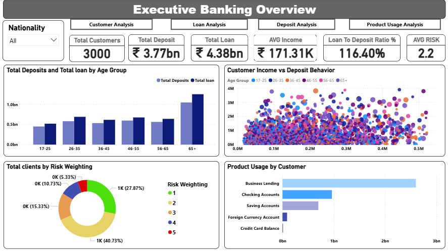
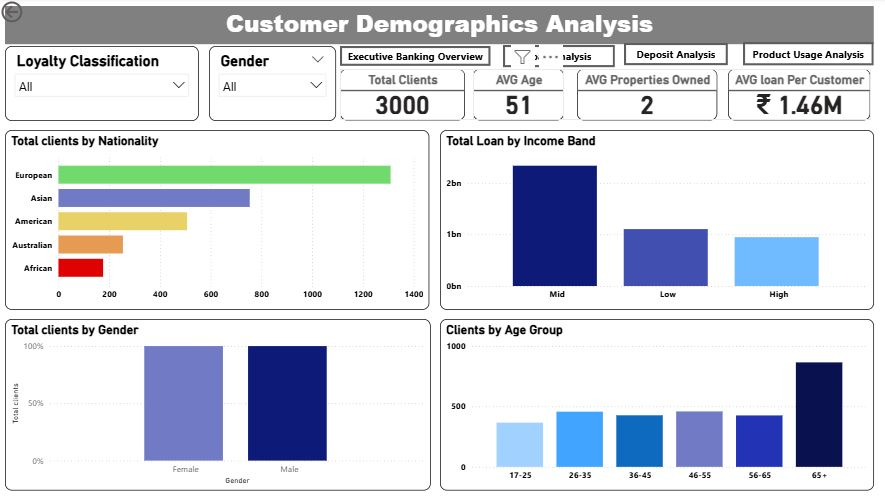
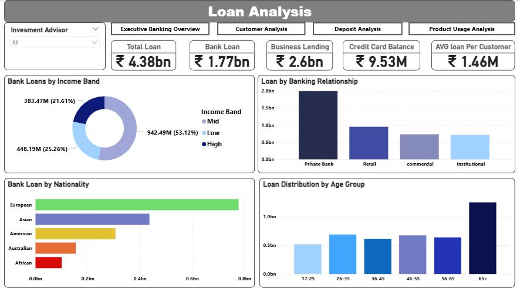
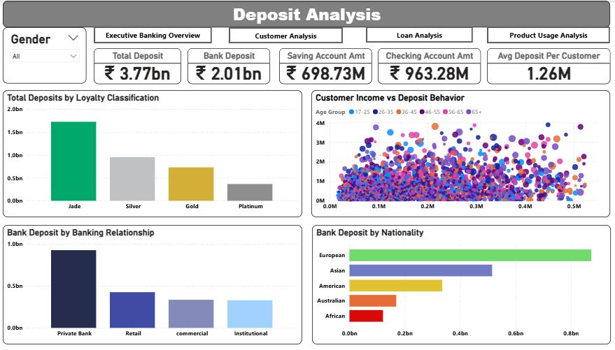
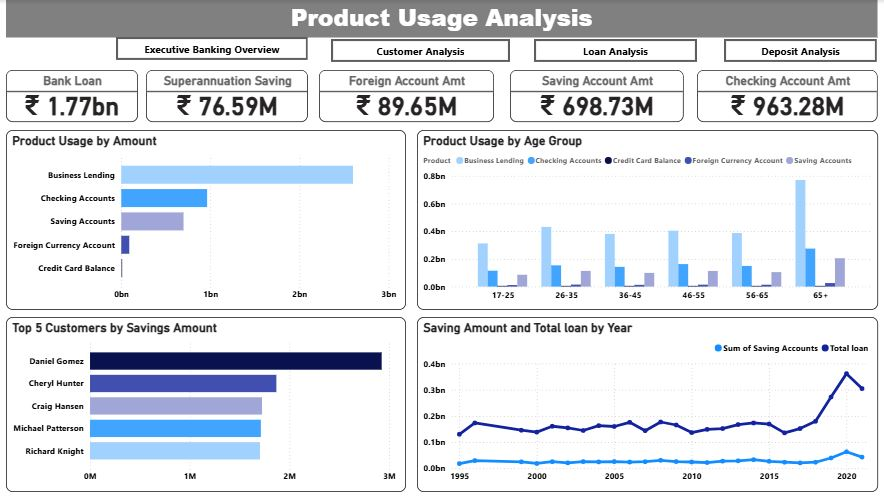
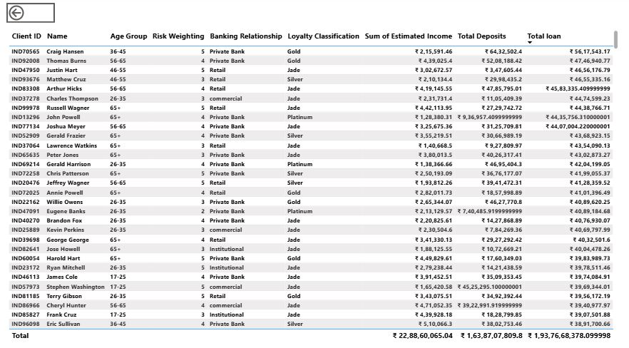
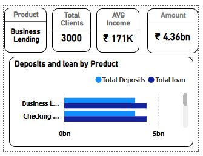

# Banking-Analytics-Dashboard

## PROJECT oVERVIEW

This project features a multi-page Executive Banking Analytics Dashboard designed to provide a 360-degree view of a financial institution's operations. The suite transforms raw transactional and demographic data into actionable insights regarding loan portfolios, deposit health, customer segmentation, and risk exposure.

The primary goal is to empower C-suite executives and branch managers to monitor key performance indicators (KPIs) like the Loan-to-Deposit Ratio (LDR), Risk Weighting, and Product Penetration in real-time.

## KEY OBJECTIVES

Centralize Financial Oversight: Provide a unified "Single Source of Truth" to monitor Total Deposits and Total Loans across the entire institution.

Monitor Liquidity & Risk: Track the Loan-to-Deposit Ratio (116.40%) and Risk Weighting (1–5) to ensure regulatory compliance and portfolio stability.

Analyze Customer Segmentation: Identify high-value demographics by Age, Nationality, and Income to drive targeted marketing and wealth management strategies.

Evaluate Product Performance: Measure the penetration and growth of core products like Business Lending, Saving Accounts, and Checking Accounts relative to loan volumes.

# DATA MODEL

The data model for this project is designed using a Star Schema approach to ensure efficient querying, scalability, and clear data relationships.

** Overview**

Central fact table: Banking

Supporting dimension tables:

Investment Advisor

Gender

Product Usage Table

Banking Relationship

Dedicated measure table: Measures (for DAX calculations)

# TECHINCAL STACK

Tool: Power BI Desktop, jupyter notebook,Excel

Data Modeling: Star Schema with centralized Fact table and Dimension tables.

DAX (Data Analysis Expressions): Used for advanced calculations (LDR%, Risk Weighting averages, and Year-over-Year growth).

Features Used: Drill-through Actions: Navigate from high-level charts to specific client lists.

Custom Tooltips: Hover-over details for "Business Lending" and other products.

Dynamic Filtering: Slicers for Nationality, Gender, and Investment Advisor.

# KEY DASHBOARD PAGES & FEATURES

1. **Executive Overview**
   
High-Level KPIs: Instant visibility into Total Customers **(3,000)**, Total Deposits **(₹3.77bn**), and Total Loans **(₹4.38bn)**.

Liquidity Monitoring: Real-time tracking of the Loan-to-Deposit Ratio (currently **116.40%),** a critical metric for banking stability.

Risk Profile: Distribution of clients by Risk Weighting (**1–5 scale**) to ensure portfolio health.

**2. Customer Demographics Analysis**

Segmentation: Breakdown of the client base by Nationality (Europe, Asia, etc.), Gender, and Age Group.

Affluence Insights: Correlation between income bands and average loan sizes.

Engagement: Tracking "Average Properties Owned" to assess customer collateral value.

**3. Loan & Deposit Deep-Dives**

Product Performance: Granular analysis of Business Lending vs. Consumer Loans.

Banking Relationships: Comparison of performance across Private Banking, Retail, Commercial, and Institutional sectors.

Loyalty Tiers: Analyzing deposit behavior across Jade, Gold, Silver, and Platinum segments.

**4. Product Usage & Trends**

Temporal Analysis: A line chart tracking "Saving Amount vs. Total Loan" from 1995 to 2020 to identify long-term growth patterns.

Top Performers: Identification of top 5 customers by savings to facilitate high-net-worth (HNW) relationship management.

# BUSINESS INSIGHTS

**Liquidity Management Alert:** The Loan-to-Deposit Ratio (LDR) stands at **116.40%**, indicating that the bank is lending more than it holds in deposits. This suggests a strategic need to aggressively drive deposit-focused campaigns (like the Jade/Gold loyalty programs) to ensure long-term liquidity.

**High-Value Silver Segment:** While the 65+ age group represents the largest volume of both deposits and loans, the **26-35** and **36-45** cohorts show significant engagement in "**Business Lending**," marking them as the primary drivers for future commercial growth.

**Portfolio Risk Concentration:** Approximately **40.73%** of clients fall under Risk Category **2**, which is relatively stable. However, the **5.33% **of clients in the highest risk category **(Level 5)** should be prioritized for immediate credit review to prevent potential NPAs (Non-Performing Assets).

**Product Dominance vs. Diversity:** Business Lending is the runaway leader in product usage by amount, dwarfing "Checking" and "Savings" accounts. There is a clear opportunity to cross-sell lower-tier products to these high-value business clients to increase "sticky" capital.

**Regional Wealth Distribution:** European and Asian nationalities contribute the lion's share of the bank's total volume. Strategic expansion or localized product offerings in the American and Australian markets could represent a significant untapped growth opportunity for the portfolio.

# DASHBOARD PREVIEW 

### Excecutive banking overview

### Customer Analysis

### Loan Analysi

### Deposit Analysis

### Product Usage Analysis

### Drill Through Page

### Tooltip page

# LIVE DASHBOARD

[View Power BI report](https://app.powerbi.com/view?r=eyJrIjoiODBkNTk4ODYtY2ZhMy00ZDkxLWI2NWItMWE2YmQwYjQ5ZDRmIiwidCI6ImZlZDkxNzcyLWMyZDItNGNlYS05ZmY5LWMwZmY3ZDdkMGU1NyJ9)

